# LandyGaugeSmall

Open-source digital instrument cluster firmware for Land Rover projects, built on ESP-IDF for the Waveshare ESP32-S3-Touch-LCD-1.85 (360x360).

Author and copyright owner: Paul Barnard (Toxic Celery).

## Project Links

- Repository: https://github.com/paulrbarnard/LandyGaugeFirmware
- GitHub Pages: https://paulrbarnard.github.io/LandyGaugeFirmware/

## Project Status

Current state: active development, hardware-tested features in daily use.

Implemented and working now:
- 8-gauge UI flow with touch and button navigation
- Day/night mode switching (vehicle-light triggered with expansion board, solar-time fallback without)
- Power and standby logic with ignition-aware wake and inactivity timeout
- Persistent settings via NVS
- Expansion board integration (inputs, outputs, ADC sensors)
- SD card support for custom images and MP3 alert assets
- BLE TPMS scanning and alarm switching
- Audio alerts and spoken status cues via external DAC/audio path

In progress:
- Broader field testing across more sensor combinations and edge cases
- Documentation screenshots and setup walkthrough improvements
- Additional gauge refinements and optional integrations

## Hardware Support

This project supports both touch and non-touch variants of the Waveshare 1.85-inch ESP32-S3 board.

### Touch Variant (default)
- Board: Waveshare ESP32-S3-Touch-LCD-1.85
- Display: 360x360 RGB LCD
- Touch: CST820 capacitive touch controller
- Navigation: touch gestures or external buttons

### Non-Touch Variant
- Board: Waveshare ESP32-S3-LCD-1.85
- Display: 360x360 RGB LCD
- Touch: none
- Navigation: external buttons
- Default Next button: GPIO0
- Default Prev button: GPIO4
- Combo press (Next + Prev within 150ms): Select
- Long combo press (1 second): long-press Select action

Note: touch support soft-fails on non-touch hardware, so one firmware image can run on both variants.

## Current Gauge Set

1. Clock (RTC + NTP sync)
2. Boost
3. EGT
4. Cooling
5. Tire Pressure (BLE TPMS)
6. Tilt (roll)
7. Incline (pitch)
8. Compass

Note: expansion-dependent gauges are automatically skipped when expansion hardware is not detected.

## Key Features

- Touch navigation (left and right tap, double-tap center to Clock, long-press gauge actions)
- Physical button navigation and combo-select behavior
- Automatic alarm-driven screen switching (EGT, cooling, TPMS, tilt)
- Wading mode and fan override controls on the Cooling gauge
- Unit switching with persistence (for example PSI/BAR and C/F)
- Time synchronization with timezone support
- 360x360 optimized rendering and image fallback loading

## Screenshots

Live project page and media gallery:
- https://paulrbarnard.github.io/LandyGaugeFirmware/

All gauges support day and night display modes. Below are screenshots from the actual hardware.

### Dashboard

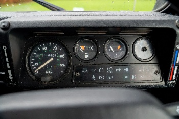

### Clock

| Day | Night |
|---|---|
| 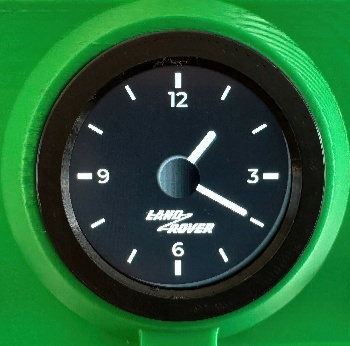 | 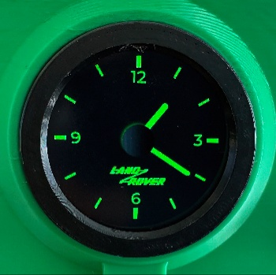 |

### Boost

| Day | Night |
|---|---|
| 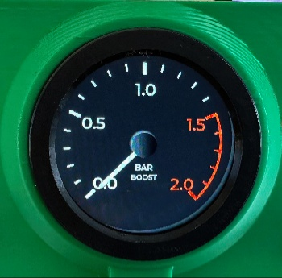 | 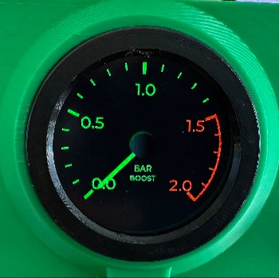 |

### EGT (Exhaust Gas Temperature)

| Day | Night |
|---|---|
| 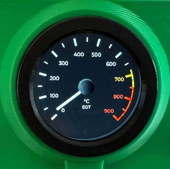 | 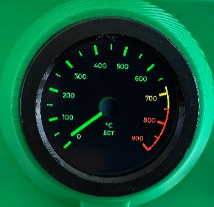 |

### Cooling

| Day | Night |
|---|---|
| 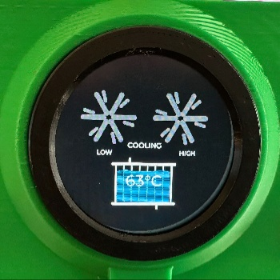 | 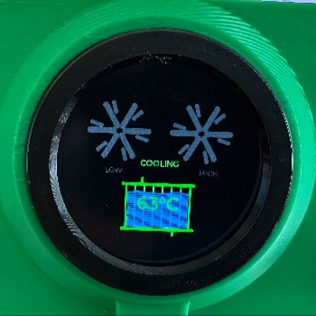 |

### Tire Pressure (BLE TPMS)

| Day | Night |
|---|---|
| 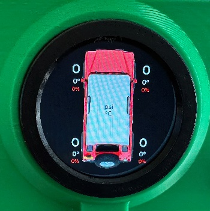 | 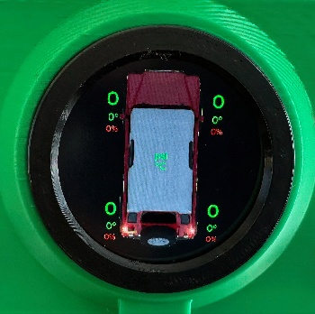 |

### Tilt (Roll)

| Day | Night |
|---|---|
| 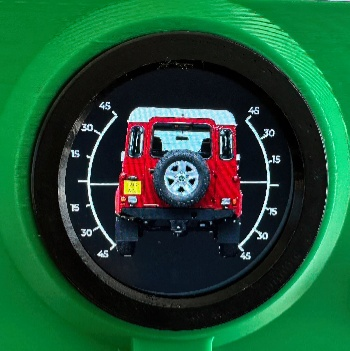 | 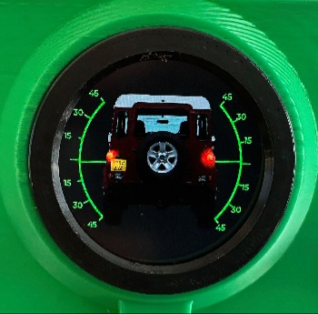 |

### Incline (Pitch)

| Day | Night |
|---|---|
| 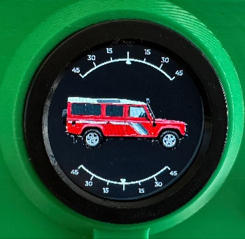 | 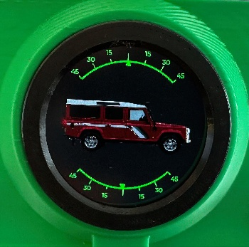 |

### Compass

| Day | Night |
|---|---|
| 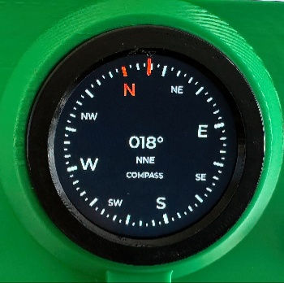 | 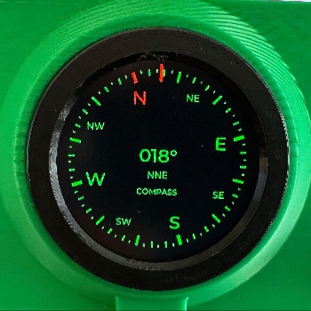 |

## Quick Start

### 1. ESP-IDF environment

Use ESP-IDF v5.5.x (currently built and tested there).

### 2. Configure

```bash
idf.py menuconfig
```

Set hardware and feature options under Example Configuration.

### 3. Build

```bash
idf.py build
```

### 4. Flash and monitor

```bash
idf.py -p /dev/tty.usbmodem* flash monitor
```

## Repository Layout

- main: application source and gauge modules
- main/ExpansionBoard: expansion board drivers and IO logic
- main/SD_Card: SD mount, assets, and image loading
- main/LVGL_Driver: display and LVGL integration
- USER_MANUAL.md: end-user behavior and controls
- TEST_PLAN.md: comprehensive validation plan

## Documentation

- User guide: USER_MANUAL.md
- Validation checklist: TEST_PLAN.md
- Hardware notes: HARDWARE_VARIANTS.md
- Scaling notes: SCALING_NOTES.md

## Open Source Notes

This project is being maintained as open source. Source files include copyright attribution for Paul Barnard (Toxic Celery).

## Acknowledgements

Built on ESP-IDF, LVGL, and Waveshare ESP32-S3 display platform components.
